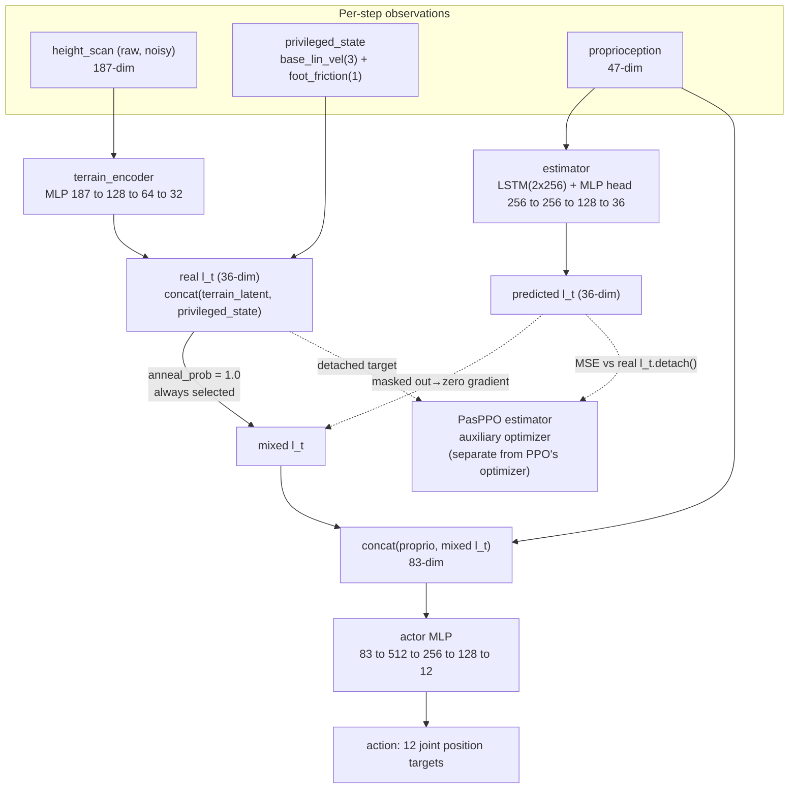
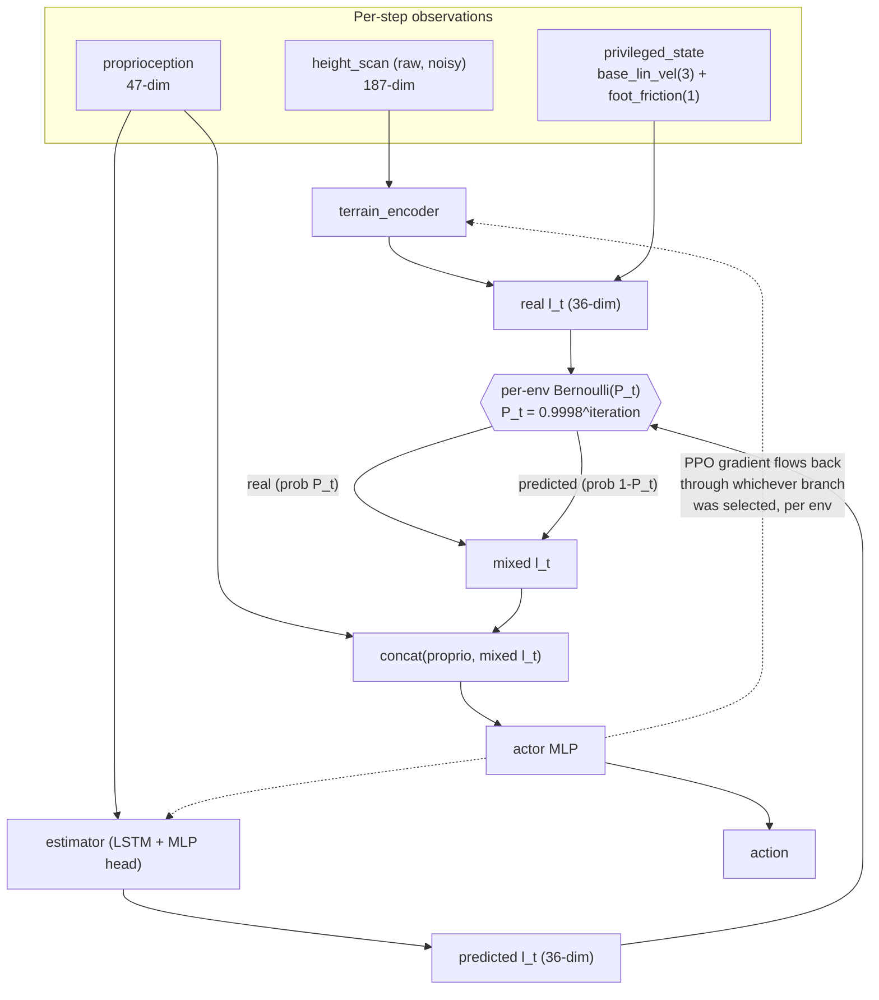
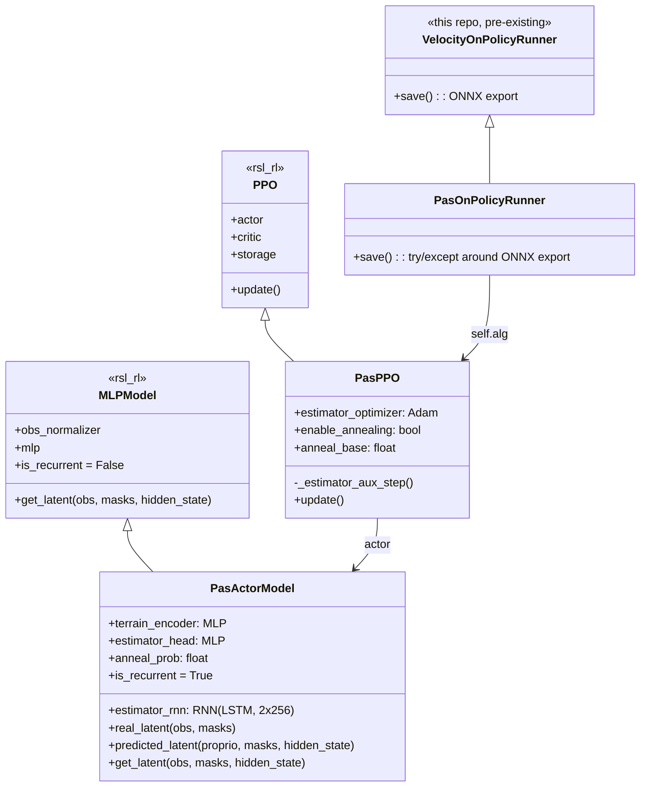
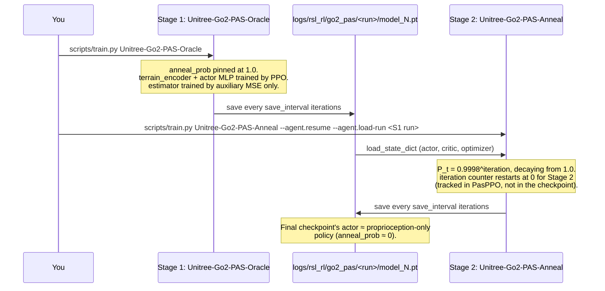

# PAS implementation (SARO, arXiv:2407.16412)

This documents the code added to replicate the low-level locomotion training
technique from **SARO** ("Space-Aware Robot System for Terrain Crossing via
Vision-Language Model", arXiv:2407.16412) — the paper's "PAS" (Probability
Annealing Selection) method — for the Unitree Go2, inside
`unitree_rl_mjlab/`. It does **not** implement SARO's VLM-based high-level
task planner (LLaVA prompting, real-camera sub-task execution) — only the
low-level policy, which is the part that is actually "a policy" trainable in
sim. See [../.claude/plans/2407-16412v3-pdf-contains-the-policy-hidden-hejlsberg.md](../.claude/plans/2407-16412v3-pdf-contains-the-policy-hidden-hejlsberg.md)
for the original feasibility assessment this was built from.

## 1. What PAS actually is

PAS is a **two-stage training-time distillation**, not a runtime switch
between frozen policies:

- **Stage 1 ("oracle")**: train a privileged actor that sees proprioception
  plus a "full latent state" `l_t` — a 32-dim encoding of a 187-point terrain
  height-scan concatenated with a 4-dim privileged state (base linear
  velocity + foot friction). A separate estimator (LSTM + MLP) is trained
  concurrently to *predict* `l_t` from proprioception history alone, via an
  auxiliary MSE loss — it has no effect on the actor yet.
- **Stage 2 ("anneal")**: resume from the Stage-1 checkpoint. Each step, each
  env independently uses either the real `l_t` or the estimator's prediction,
  with the probability of using the real one decaying as `P_t =
  0.9998^iteration`. Both branches stay in the autograd graph, so PPO's own
  backward pass fine-tunes the estimator jointly with the rest of the actor
  whenever its branch was sampled. Training ends with a policy that only
  needs proprioception history to run.

## 2. Stage 1 (oracle) data flow



In Stage 1 the Bernoulli selector is degenerate (`p=1.0`), so `real l_t`
deterministically wins every step; `terrain_encoder` gets ordinary
policy-gradient updates through the actor MLP, exactly like the paper's Fig.
4. The estimator's *only* training signal here is the auxiliary MSE loss —
it contributes nothing to the action, hence gets no RL gradient, matching
"Oracle Policy Training" in the paper.

## 3. Stage 2 (anneal) data flow



As `P_t → 0` over training, the estimator increasingly supplies the actor's
input and receives gradient directly from the RL loss — the paper's "the
loss of RL is utilized to simultaneously optimize both the estimator and the
low-level MLP." The critic is unaffected by any of this: it always sees the
full, unencoded privileged observation (see `"critic"` + `"privileged_state"`
obs groups) and is a stock `MLPModel`.

## 4. Class map



All five new classes live in one file, `src/tasks/velocity/mdp/pas.py`. They
plug into `mjlab`/`rsl_rl` entirely through existing, documented extension
points (`class_name` string resolution for actor/critic/algorithm classes,
and the same runner-subclassing pattern `VelocityOnPolicyRunner` already
uses) — no fork of either library.

## 5. Two-stage training pipeline



## 6. Files touched

| File | Change |
|---|---|
| `src/tasks/velocity/mdp/pas.py` | **New.** `foot_friction` obs term, `PasModelCfg`, `PasPpoAlgorithmCfg`, `PasActorModel`, `PasPPO`, `PasOnPolicyRunner`. |
| `src/tasks/velocity/mdp/__init__.py` | Re-exports `pas.py`. |
| `src/tasks/velocity/config/go2/env_cfgs.py` | New `unitree_go2_pas_env_cfg()`: adds the `"privileged_state"` obs group, a gap-crossing terrain (stepping-stones, rebalanced into `ROUGH_TERRAINS_CFG`'s proportions), and the paper's `energy`/`joint_vel_l2` reward terms. |
| `src/tasks/velocity/config/go2/rl_cfg.py` | New `unitree_go2_pas_ppo_runner_cfg(enable_annealing)`: wires `PasModelCfg`/`PasPpoAlgorithmCfg` via `class_name` string resolution, and `obs_groups = {"actor": ("actor","privileged_state"), "critic": ("critic","privileged_state")}`. |
| `src/tasks/velocity/config/go2/__init__.py` | Registers `Unitree-Go2-PAS-Oracle` (`enable_annealing=False`) and `Unitree-Go2-PAS-Anneal` (`enable_annealing=True`), both on `PasOnPolicyRunner`. |

## 7. Known gaps

- **ONNX export isn't PAS-aware yet.** `MLPModel.as_onnx()`'s generic wrapper
  assumes `get_latent()` is a plain concat-and-normalize, which is false for
  `PasActorModel`. `PasOnPolicyRunner.save()` catches this so checkpointing
  never crashes a training run, but a real deployable `policy.onnx` needs a
  custom `PasActorModel.as_onnx()`/`as_jit()` (mirroring how `RNNModel`
  provides its own) that bakes in `proprioception → estimator → action`. Not
  needed for training or for the Stage 1 → Stage 2 handoff (`.pt` checkpoints
  are unaffected) — only for eventual real-robot deployment.
- **`P_t` is keyed to environment steps via `PasPPO`'s own iteration
  counter**, not literal PPO iterations restored from a checkpoint — it
  always restarts at 0 when a new `PasPPO` is constructed (i.e., once per
  `train.py` invocation), which is the correct behavior for Stage 2 starting
  its own fresh anneal, but means interrupting and resuming *mid-Stage-2*
  would also restart the anneal schedule. Not an issue for the intended
  Stage 1 → Stage 2 handoff, but worth knowing if a Stage 2 run itself needs
  to be resumed after a crash.
- **Gap terrain uses `stepping_stones`**, which approximates but isn't
  geometrically identical to the paper's "gap" intermediation.
- **Environment quirk (not code):** this conda env's editable
  `unitree_rl_mjlab` install resolves `import src` to a different, unrelated
  project (`/home/rohan/unitree_rl_mjlab`). Run everything below with
  `PYTHONPATH` pointed at *this* repo's `unitree_rl_mjlab/`, as shown.

## 8. Running it

```bash
cd /home/rohan/rl/policyswitching/unitree_rl_mjlab
export MUJOCO_GL=egl
export PYTHONPATH=/home/rohan/rl/policyswitching/unitree_rl_mjlab:$PYTHONPATH

# Stage 1 (oracle)
python scripts/train.py Unitree-Go2-PAS-Oracle \
  --env.scene.num-envs <N> \
  --agent.logger tensorboard

# Stage 2 (anneal), resuming from Stage 1
python scripts/train.py Unitree-Go2-PAS-Anneal \
  --env.scene.num-envs <N> \
  --agent.logger tensorboard \
  --agent.experiment-name go2_pas \
  --agent.resume True \
  --agent.run-name stage2

# Watch training
tensorboard --logdir logs/rsl_rl/go2_pas

# Visually evaluate a checkpoint
python scripts/play.py Unitree-Go2-PAS-Oracle \
  --checkpoint_file logs/rsl_rl/go2_pas/<run>/model_<iter>.pt
```

Both tasks default to the paper's `max_iterations=40000` and
`num_steps_per_env=24`; override `--agent.max-iterations` for a shorter
first run. `--env.scene.num-envs` has no default baked into the PAS
configs beyond whatever the base Go2-Rough config uses — pick a value your
GPU's VRAM supports (see the next section).
