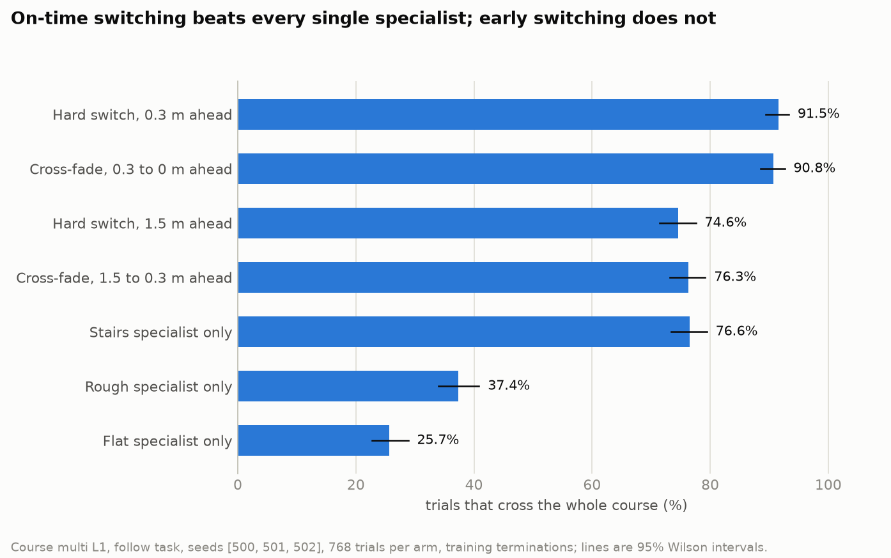
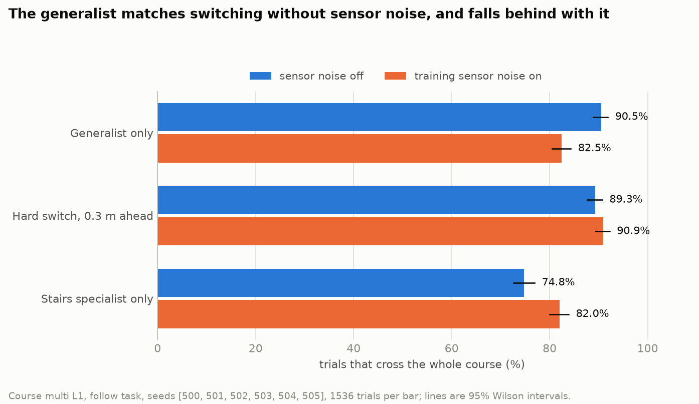
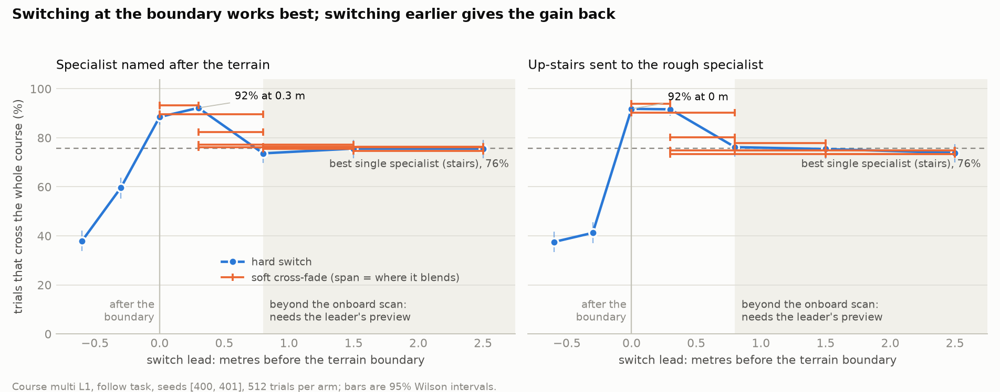
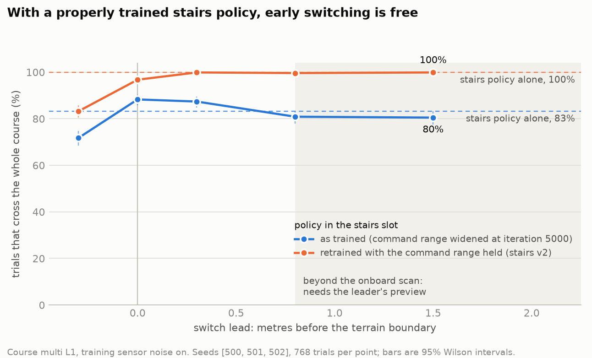

# Terrain-Specialist Switching for a Person-Following Quadruped: Does Looking Further Ahead Help?

*Project report, 2026-10-05. Simulation study, Unitree Go2 in `mjlab` (MuJoCo). Every number
here traces to a file named in the Appendix.*

## Abstract

A quadruped that follows a person could, in principle, use that person as a preview of the
terrain ahead and switch between terrain-specialist locomotion policies before its own sensors
see the change. We trained three specialists (flat, rough, stairs) and a matched generalist
for a Unitree Go2 and tested the idea in a pre-registered experiment on a mixed-terrain
course, with the robot following a scripted leader. Three findings. First, the anticipation
hypothesis is not supported: the switch must not be late (0.3 m late costs 13 to 33 points of
course success), but switching earlier than the boundary is never better, and a small
classifier on the robot's own height scan times the switch as well as ground-truth labels do.
The followed person adds neither useful horizon nor useful labels. Second, whether switching
beats a single policy depends on the conditions: with the policies as trained it beats the
best specialist by 15 points (7 with sensor noise on), and it beats the matched generalist by
8 points with sensor noise on and not at all without. Third, and largest, the policies'
training mattered more than any switching. A curriculum interaction demoted both non-flat
specialists to near-flat terrain halfway through training. A stairs policy retrained without
it, used alone, crosses the whole course over 99% of the time, better than every switching
system built from the original policies, and switching on top of it adds nothing. It also
beats the generalist by a wide margin, including a generalist retrained the same way (65 to
73%): on this course specialisation paid, and run-time switching did not. We also report a replication of the
SARO vision-language pipeline in which a 4B local model fails to perceive simulated stairs,
and a two-rate perception design that makes camera-based person-following run in real time.

## I. Introduction

Most learned quadruped locomotion uses one policy for every surface, often with a terrain
encoder or a short exteroceptive preview such as a height scan. The alternative studied here is
a small set of specialist policies, each trained on one terrain class, with a module that
decides which one is in control.

The project's specific hypothesis comes from the person-following setting. The robot's own
height scan reaches about 0.8 m ahead of its base. A person being followed walks a few metres
ahead, over terrain the robot will reach later, so their path is a free preview beyond that
horizon. If knowing the terrain further ahead lets the robot switch or blend policies earlier
and more smoothly, a follower should out-perform a robot that reacts only to what its own scan
sees. The claim is about *horizon extension*, so the experiment is built to measure outcome as
a function of how far ahead of a terrain boundary the switch begins.

The design is a 2×2 of {hard switch, soft blend} × {reactive, anticipatory}, against
fixed-policy baselines and a matched generalist, with every comparison isolating one factor. A
null result was anticipated as possible and the analysis rules were fixed in advance so that
it would be reportable.

**Contributions.**

1. A negative result for the anticipation hypothesis under best-case conditions for it
   (exact labels, exact boundary positions), with the mechanism: the best switch moment lies
   inside the onboard sensing horizon and nothing is gained by being earlier.
2. A measurement of how success depends on switch timing, and a demonstration that an
   onboard scan classifier is sufficient to time the switch.
3. A closed-loop comparison of switching against fixed specialists and against a matched
   generalist, showing when switching wins and when it does not.
4. A diagnosis, with measurement, of why the specialists are weak: an interaction between
   two training curricula that is invisible in reward and episode length, and whose removal
   is worth more than everything else in the study.
5. Two side results: a SARO-protocol replication with a small local vision-language model,
   and a two-rate perception architecture for person-following.

## II. Background and related work

*Bibliographic details of the works below other than SARO were not re-checked against the
sources and should be verified before external submission.*

Single-policy approaches include Rapid Motor Adaptation (online adaptation through a learned
latent), the ETH perceptive-locomotion line for ANYmal (policies reading an elevation map or
height scan), and massively parallel PPO training ("Learning to Walk in Minutes"), from which
this project's training stack descends. SARO (arXiv:2407.16412) uses a vision-language model
to plan, perceive and double-check sub-tasks for crossing one terrain obstacle, on top of a
low-level policy trained by Probability Annealing Selection (PAS), a two-stage distillation
from a privileged policy to a proprioceptive one. PAS produces one generalist policy; it is
not a runtime switch between policies.

Explicit switching between discrete terrain specialists is less common, and to our knowledge
using a followed person's trajectory as terrain preview has not been tested.

## III. System

### A. Robot, simulator and terrain

Unitree Go2 in `mjlab`, 50 Hz control. Terrain is geometric only: flat, rough (random and
wave heightfields), stairs (pyramid stairs, 0.3 m tread, riser 0 to 0.10 m), and
stepping-stone gaps. The actor observation is 234-dimensional and includes a 187-ray height
scan over a 1.6 m × 1.0 m grid centred on the base, so it sees 0.8 m ahead. In training each
ray carries uniform noise of ±0.1 m.

### B. Policies

Three specialists, each trained with PPO (RSL-RL) on one terrain class for 10,000 iterations
at 8,192 environments, sharing one observation space, reward and network shape so they can be
swapped or blended inside one environment. The **generalist** is the same in every respect
except that it trains on the union of the four terrain classes. A gaps specialist failed
twice under its original design; a blended-terrain retrain finished but has not been
evaluated and is not used here.

### C. Follow task and course

The leader is a scripted point walking the course centreline at 0.5 m/s, 3.0 m ahead of the
robot. The robot's velocity command comes from a follow controller (line-of-sight velocity
feed-forward plus a proportional term on the gap), so the command rises when the robot falls
behind. The course `multi` is a straight strip: flat 3 m, rough 3 m, flat 2 m, stairs up
1.5 m, flat 2 m, stairs down 1.5 m, flat 3 m. Level L1 has 0.05 m risers and 0.02 to 0.06 m
rough-ground relief; L2 has 0.07 m and up to 0.08 m.

A trial ends in **success** (base 1.5 m past the last stair), **fall**, or **lost** (leader
more than 6 m away). A fall is one of the policies' own training terminations: bad
orientation, or any non-foot body touching the ground with more than 10 N. SARO's definition
(orientation only) is used as a robustness check.

### D. Switch schedules

A switch into a non-flat segment is described by a *lead*: how many metres of base travel
before the segment's first edge the incoming specialist takes over. A hard switch has one
lead. A soft switch has a start and an end lead and blends the two specialists' actions
linearly in between. A negative lead means the switch happens only after the robot is already
on the new terrain, as with a detector that needs to be on a terrain to recognise it. Leaving
a segment is the same in every arm: the specialist releases when the rear of the footprint
has cleared it.

All schedule arms read the true segment layout. The only thing a lead encodes is horizon: a
lead of at most 0.8 m could be supplied by the robot's own scan, and a longer one needs
terrain knowledge from beyond it, which is what a followed person provides. This keeps sensor
quality out of the comparison. A hard switch with a 0.3 m lead is the "footprint rule" used
as the oracle in the project's earlier experiments (switch when the front of the footprint
reaches the edge).

### E. Scan classifier

For a reactive arm that uses no ground truth, a small MLP (187 → 128 → 64 → 3) reads the
height-scan slice of the actor observation and predicts which specialist the footprint rule
has active. Its class probabilities pass through an exponential average and a hold-to-switch
filter, and the result drives a hard switch. It is trained on single-obstacle courses and
never on `multi`.

## IV. Experimental design

**Premise gates.** Before any switching experiment, two premises were tested directly:
that no single specialist is best on every terrain (a cross-terrain evaluation matrix), and
that the height scan carries enough information to tell terrain classes apart (a classifier
on labelled scans with no policy in the loop).

**Pre-registration.** Hypotheses, arms, metrics and decision rules for the switching
experiment were committed before any timing data existed. Stage 1 (seeds 400, 401; 512 trials
per arm) swept seven hard leads and eight soft schedules and selected the best arm in each
cell of the 2×2. Stage 2 (fresh seeds 500, 501, 502; 768 trials per arm) evaluated only the
selected arms and the baselines. Addenda, each committed before its data existed, cover the
scan-classifier arm, the generalist arm (with a replication on seeds 503 to 505 once its two
noise conditions disagreed), re-runs with two better stairs policies, the generalist's
earlier checkpoint, and a retrained generalist.

**Metrics.** Course success with Wilson intervals; differences of proportions with Newcombe
intervals. Boundary smoothness is action rate and actuator-force rate inside ±0.5 m of base
travel around each terrain-class boundary, relative to the same arm's whole-rollout value. It
is tied to the terrain layout and never to the arm's own switch events, since a blend has
none.

**Two sensing conditions.** The evaluation environment was built on a configuration that turns
observation noise off, so the experiment as pre-registered ran without the noise the policies
were trained with. Every main comparison was therefore repeated with the training noise on.
Both are reported; "noise on" is the more deployment-like condition.

## V. Results

### A. Specialists differ by terrain; the generalist is close to the best of them on each

Falls per 100 m travelled at pinned difficulty 0.5, with training noise on (128 robots for
24 s per cell; the generalist row was measured on 2026-10-04 with the same settings):

| policy \ terrain | flat | rough | stairs | gaps | mixed |
|---|---|---|---|---|---|
| Flat specialist | 0.00 | 14.41 | 10.42 | 684 | 154 |
| Rough specialist | 0.00 | **5.36** | 11.14 | 1357 | 272 |
| Stairs specialist | 0.00 | 13.02 | **7.60** | 975 | 303 |
| Generalist | 0.00 | 4.70 | 8.33 | 29.7 | 7.5 |

Among the specialists the best policy changes with the terrain, which is the condition
switching needs. The rough margin is solid (2.4× the runner-up under three different fall
metrics); the stairs margin is 1.4× on a single seed. The generalist is close to the best
specialist on rough ground and stairs (differences of that size are within the sampling noise
of a cell), and it is the only policy that copes with stepping-stone gaps at all, though it
does so at 10% of commanded speed. The course used below has no gaps segment, so it does not
test that advantage.

The stairs specialist is weak in absolute terms: on its own training terrain it falls 6.1,
12.6 and 16.9 times per 100 m at difficulty 0.5, 0.7 and 0.9, nearly all from non-foot contact
with a step edge.

**The generalist depends on its height scan; the specialists barely do.** Replacing the scan
with a constant (the policy's own average scan) on the same pinned terrain:

| generalist, falls per 100 m | flat | rough | stairs | gaps |
|---|---|---|---|---|
| with its scan | 0.00 | 4.70 | 8.33 | 29.7 |
| scan replaced by a constant | 65.4 | 188.4 | 67.0 | 430 |

The same ablation moved the specialists' fall rates by between −16% and +30%. For a policy
trained on every terrain the scan is how it tells them apart, and a constant scan is a wrong
picture of the ground, not merely a missing one, which is why it falls even on flat ground.
This closes the project's second premise gate: a policy that saw varied terrain in training
uses the scan heavily.

### B. Switching against single policies



Pre-registered confirmation (seeds 500 to 502, 768 trials per arm, noise off):

| arm | success (95% CI) | per seed |
|---|---|---|
| hard switch, 0.3 m ahead | **91.5%** (89.4-93.3) | 91.0 / 92.2 / 91.4 |
| cross-fade over the last 0.3 m | 90.8% (88.5-92.6) | 89.1 / 92.6 / 90.6 |
| hard switch, 1.5 m ahead | 74.6% (71.4-77.6) | 73.0 / 72.3 / 78.5 |
| cross-fade from 1.5 m to 0.3 m | 76.3% (73.2-79.2) | 74.2 / 75.8 / 78.9 |
| stairs specialist only | 76.6% (73.4-79.4) | 71.9 / 77.3 / 80.5 |
| rough specialist only | 37.4% (34.0-40.8) | 34.4 / 38.3 / 39.5 |
| flat specialist only | 25.7% (22.7-28.9) | 25.4 / 25.4 / 26.2 |

**Against the best fixed specialist, H1 is supported**: +15.0 points (95% CI +11.4 to +18.6).
Pooled over every run of the two arms (2,304 trials each): +14.6 points with noise off
(90.0% vs 75.4%) and +7.3 with noise on (89.7% vs 82.4%, CI +5.3 to +9.3).

**Against the matched generalist, switching wins only with sensor noise on.**



| sensing (1,536 trials per arm) | generalist alone | hard switch 0.3 | difference (95% CI) | by run |
|---|---|---|---|---|
| noise off | **90.5%** | 89.3% | −1.2 (−3.4 to +0.9) | −0.7, −1.8 |
| training noise on | 82.5% | **90.9%** | +8.4 (+6.0 to +10.8) | +9.2, +7.6 |

Two independent runs on different seeds agree. The generalist is walking, not bracing: it
never loses the leader, and its tracking error and traverse time equal the switching arm's.
With noise on it loses trials at the lip of the down-stairs (0.7% → 5.4%) and on the stairs
(8.3% → 11.2%), while every specialist does better with noise on than off. This fits the
ablation in Section V.A: the generalist relies on the scan to know what terrain it is on, so
noise on the scan costs it, and the specialists, which lean on the scan far less, are not hurt.
The link is an inference from those two measurements, not a direct test.

### C. Switch timing: not late, and no benefit from early



Calibration sweep of the hard-switch lead with the specialists as trained (512 trials each):

| lead (m) | −0.6 | −0.3 | 0.0 | 0.3 | 0.8 | 1.5 | 2.5 |
|---|---|---|---|---|---|---|---|
| success | 37.9% | 59.6% | 88.5% | **92.2%** | 73.6% | 75.6% | 75.6% |

Success peaks with the switch 0 to 0.3 m before the boundary. Later than that it collapses,
because the flat specialist is still in control on the up-stairs and cannot climb. Earlier
than that it drops to the level of the stairs specialist alone and stays there out to 2.5 m.

**H3 is not supported.** On the confirmation seeds a hard switch 1.5 m ahead is 16.9 points
worse than one 0.3 m ahead (CI −20.6 to −13.3), and a cross-fade starting 1.5 m ahead is 14.5
points worse than one starting 0.3 m ahead (CI −18.1 to −10.8). Neither differs from never
switching (−2.0, CI −6.2 to +2.3).

The cost of switching early is located in one place:

| arm | failures in the last 0.25 m before the down-stairs edge | failures on the down-stairs |
|---|---|---|
| hard switch 0.3 m ahead | **0.0%** | 7.2% |
| hard switch 1.5 m ahead | **15.2%** | 8.9% |
| cross-fade from 1.5 m | **13.5%** | 9.2% |
| stairs specialist only | **12.9%** | 9.4% |

The as-trained stairs specialist, having walked the flat approach, touches a knee or calf to
the edge in 13 to 15% of trials as it steps off. The flat specialist walking the same approach
and handing over 0.3 m before the edge never does. Section V.G shows this is a defect of that
particular stairs policy: with an undamaged one the early side of the curve is flat. In
neither case is early *better*. A controller with a long preview horizon is free to switch at
0.3 m, and the data say it loses nothing by doing so. The gain from extending the horizon
beyond what the scan already covers is zero.

### D. Blending adds nothing

**H2 is not supported.** A cross-fade over the last 0.3 m against a hard switch at 0.3 m:
success −0.8 points (CI −3.6 to +2.1); boundary action rate 1.021 against 1.022 of the arm's
rollout mean (difference −0.002, CI −0.006 to +0.002); actuator-force rate the same. There is
no boundary transient to smooth: a hard switch between these specialists raises the action
rate near a boundary by about 2% over the rollout average. At L2 blending is worse than a
hard switch (−6.4 points under training terminations, −14.1 under orientation-only falls).

### E. The robot's own scan is enough

| sensing | per-step accuracy, held out | label-timed switch | scan-classifier switch | difference (95% CI) | median lead at the three segment entries |
|---|---|---|---|---|---|
| training noise on | 83.8% | 88.3% | 87.5% | −0.8 (−4.1 to +2.5) | +0.17 / +0.20 / +0.23 m |
| noise off | 99.6% | 90.6% | 90.0% | −0.7 (−3.6 to +2.3) | +0.28 / +0.27 / +0.26 m |

**H4 holds in both conditions.** With noise on, a single scan confuses flat and rough about a
quarter of the time but recognises stairs 96% of the time, and the filter averages the rest
away. The classifier never first selected a segment's specialist after the boundary. So the
on-time switch that Section C shows to be necessary can be delivered by onboard sensing, and
the leader's path is not needed as a source of labels either.

This is the easy case for a classifier: the test course uses the same straight 0.05 m stairs
it trained on, and it was tested with the as-trained specialists at L1 only. An earlier
measurement on the training terrain generator, pooled over difficulty, found rough and stairs
much harder to separate, though that measurement was later shown to be inflated by near-flat
samples labelled as rough or stairs.

### F. Robustness of the timing result

Differences in points of course success, with 95% intervals, specialists as trained.

| condition | stairs only | hard 0.3 | switching value | 1.5 m early vs 0.3 m | cross-fade vs hard |
|---|---|---|---|---|---|
| **L1, as pre-registered** (n = 768) | 76.6% | 91.5% | +15.0 (+11.4, +18.6) | −16.9 (−20.6, −13.3) | −0.8 (−3.6, +2.1) |
| L1, observation noise on (n = 768) | 83.2% | 87.4% | +4.2 (+0.6, +7.7); +7.3 pooled over three runs | −6.9 (−10.6, −3.2) | +0.7 (−2.6, +4.0) |
| L1, orientation-only falls (n = 768) | 99.2% | 98.4% | none: −1.6 vs rough only at 100% | +0.5 (−0.7, +1.8) | +1.2 (+0.2, +2.3) |
| L2, training falls (n = 512) | 33.4% | 51.0% | +17.6 (+11.6, +23.4) | −16.2 (−22.1, −10.2) | −6.4 (−12.5, −0.3) |
| L2, orientation-only falls (n = 512) | 79.1% | 89.6% | +10.5 (+6.1, +15.0) | −2.3 (−6.3, +1.6) | −14.1 (−18.6, −9.5) |

All the L1 failures are knee or calf contacts; if only tipping over counts as a fall, nothing
fails at L1 and the course cannot separate the arms. With harder stairs the switching
advantage returns under either definition. Nothing changes the direction of the timing
result: switching early is never better than switching at the boundary, and switching late is
always much worse.

### G. Why the specialists are weak, and what an undamaged one does

The training logs of the stairs and rough specialists show the same event:

| | terrain level at iteration 5000 | peak, iteration 5100 | iteration 6000 | iteration 9999 |
|---|---|---|---|---|
| Stairs | 1.92 | 2.63 | 0.79 | 0.97 |
| Rough | 2.14 | 2.65 | 0.42 | 0.53 |

Training has two curricula. One widens the commanded velocity range at exactly iteration 5000
(forward speed from at most 1.0 to at most 2.0 m/s). The other moves a robot to harder terrain
when it covers enough ground and to easier terrain when it covers less than half of what its
command asked for. When the command range doubles, the policies are demoted to the easiest
terrain rows and never climb back. Terrain level runs from 0 to 9 and a stair riser is about
1 cm per level, so the stairs specialist spent its last 4,700 iterations on risers of about
1 cm. Mean reward and episode length are flat across the collapse, so it is invisible unless
terrain level is plotted.

Two undamaged stairs policies were then obtained. The first is free: the stairs run saved a
checkpoint at iteration 4800, before the collapse. On pinned pyramid stairs it falls 1.6, 4.1
and 5.1 times per 100 m at difficulty 0.5, 0.7 and 0.9, against 4.1, 12.0 and 18.1 for the
final checkpoint at the same speed: the second half of training made the stairs specialist
about three times worse at stairs. The second is a retrain, **stairs v2**: the same task from
scratch with the command range held where the follow task uses it. Its terrain level kept
rising through iteration 5000 instead of collapsing.

Each was put in the stairs slot, with nothing else changed, and the course re-run
(pre-registered before either was run):



Stairs v2 in the stairs slot:

| | L1, noise off (n = 768) | L1, noise on (n = 768) | L2, noise off (n = 512) |
|---|---|---|---|
| stairs policy alone | **99.7%** | **99.9%** | **95.5%** |
| hard switch 0.3 m late | 70.8% | 83.2% | 30.1% |
| hard switch at the boundary | 99.6% | 96.7% | 49.8% |
| hard switch 0.3 m ahead | 100.0% | 99.9% | 96.3% |
| hard switch 1.5 m ahead | 99.9% | 99.9% | 97.7% |
| early minus on-time (1.5 − 0.3) | −0.1 (−0.7, +0.4) | 0.0 (−0.6, +0.6) | +1.4 (−0.8, +3.6) |
| switch 0.3 minus stairs alone | +0.3 (−0.3, +0.9) | 0.0 (−0.6, +0.6) | +0.8 (−1.7, +3.3) |
| stairs alone, iteration-4800 checkpoint | 97.7% | 94.9% | 82.8% |
| stairs alone, as trained | 76.6% | 83.2% | 33.4% |

- **The early-switching penalty disappears.** The failures at the lip of the down-stairs go
  from 13-15% to zero. Early switching becomes free. It does not become better than on-time,
  so the conclusion about preview no longer rests on a defective specialist.
- **Switching stops beating the best single policy.** With either undamaged stairs policy,
  that policy alone matches every switching arm at both levels. The 15-point advantage of
  Section B was the size of the damage.
- **One well-trained policy beats every system built from the as-trained ones**: 99.7% and
  99.9% (noise off and on), against 90.0% and 89.7% for switching between the as-trained
  specialists and 90.5% and 82.5% for the generalist.
- **Specialists beat the generalist, and the switch is not what does it.** The generalist
  was retrained with the same fix (generalist v2) and compared on six seeds:

  | | L1, noise off | L1, noise on | L2, noise off |
  |---|---|---|---|
  | generalist v2 alone | 64.9% | 72.7% | 15.8% |
  | first generalist alone | 90.5% | 82.5% | 10.9% |
  | stairs v2 alone | 99.9% | 99.8% | 95.3% |
  | switching, stairs v2 in the bank | 99.9% | 99.8% | 96.7% |
  | stairs v2 − generalist v2 | +35.0 (+32.6, +37.4) | +27.1 (+24.9, +29.4) | +79.5 (+75.4, +82.8) |

  Stairs v2 alone is far ahead of either generalist, and switching on top of it is within
  1.4 points of it everywhere.
- **The fix that made the stairs policy did not make a better generalist.** Generalist v2 is
  10 to 26 points *below* the first generalist at L1. It sits where the first generalist's own
  iteration-4800 checkpoint did (73.2% and 75.3%): both saw only the narrow command range. For
  the generalist, the second half of the original training was a net gain on this course even
  though its terrain curriculum collapsed. Both generalists walk properly and fail in the same
  place, the down-stairs. Three checks did not find the cause: generalist v2's training curves
  are the healthier of the two (no curriculum collapse, equal or higher reward); the follow
  task never commands outside the range it trained on; and on pinned pyramid stairs at that
  command range generalist v2 is the *better* of the two (4.7 against 7.1 falls per 100 m at
  difficulty 0.5, 15.5 against 20.8 at 0.7). So its deficit is specific to this course's
  straight down-staircase, and "worse" here means worse on this course, not worse at stairs.
  A diagnostic on single staircases (two directions, two riser heights, three leader speeds,
  noise off and on) then showed generalist v2 ahead of or level with the first generalist in
  20 of 24 cells, and showed something more basic: the same generalist on the same 5 cm
  down-staircase at the same commanded speed succeeds 6% of the time after a 3 m flat approach,
  50% after 11 m, and 92% on the mixed course. Both generalists are brittle at the top edge of
  a down-staircase in a way that depends on the course around it, for a reason not found.
  Stairs v2 stays at 93% or above in every one of those cells.
- **Lateness gets more expensive on harder stairs**: at L2 a switch at the boundary instead
  of 0.3 m ahead of it falls from 96.3% to 49.8%.

### H. Side results

**PAS replication.** The SARO low-level policy was trained in full (80,000 iterations, about
8× a specialist's budget). It survives flat ground and stairs almost perfectly, but only
because it barely moves: achieved speed is 8 to 11% of commanded on every terrain, against 24
to 46% for the specialists. Two extra reward terms that penalise motion explain it. It is
reported as a replication, not as a baseline.

**Vision-language specialist selection.** SARO's plan, perceive and double-check loop was
rebuilt with a local 4B model (Gemma-4-E4B) choosing among the three specialists, and run at
SARO's own protocol of 20 trials per obstacle:

| obstacle | VLM success | success with ground-truth choices | planner's answer |
|---|---|---|---|
| stairs up | 0% | 75% | "no obstacle" 20/20 |
| stairs down | 45% | 95% | "no obstacle" 20/20 |
| rough | 100% | 100% | mixed |

The model does not perceive the simulated stairs at all, and the 100% on rough ground is not
evidence of perception, since every specialist crosses rough ground. Depth geometry, by
contrast, locates step edges to within 0 to 8 cm.

**Person-following perception.** With a ground-truth leader the robot holds a 2.5 m gap to
0.16 m RMS through seven speed changes. Putting the VLM inside the control loop fails (5.9 m
gap error, 10× slower than real time). Splitting the job works: the VLM names the target
class once, off the control path, and a detector localises it every control step in about
4 ms. Gap error is then 0.50 m at real-time speed. A stock COCO detector cannot see the
simulated leader; fine-tuning on 1,000 frames labelled automatically from the leader's known
pose gives precision 1.00 and recall 0.94.

## VI. Discussion

The hypothesis was that a followed person extends the robot's terrain preview and that the
extension improves policy switching. The experiment separates two ways that could be true and
finds neither.

*Horizon.* The switch must happen by about 0.3 m before the boundary. The robot's own scan
reaches 0.8 m. Extra horizon can only be spent on switching earlier, and switching earlier is
either harmful (when the incoming specialist is poor on the approach to its own terrain) or
neutral (when it is not). Nor is there a transition transient that a longer, gentler hand-over
could smooth, since a hard switch barely registers in action rate.

*Labels.* Being late is expensive, so a prompt, reliable terrain label matters. The leader's
path could have been valuable as such a label. But a 33,000-parameter classifier on the
robot's own noisy scan already delivers the switch 0.2 m before the boundary and matches
ground truth.

On whether to switch at all, the answer the project set out to give ("specialists plus a
switch beat a generalist") turned out to depend on things the design treated as fixed.
With the policies exactly as trained and sensor noise on, switching beats the matched
generalist by 8 points. With sensor noise off it does not. And once the stairs policy is
trained without the curriculum interaction, that single policy beats all of them and the
switch contributes nothing. So specialisation helped here, in the sense that a policy trained
on stairs alone outperformed one trained on everything, by 27 to 35 points against a
generalist trained the same way and by 80 on harder stairs, but selecting among specialists
at run time did not. The most valuable hour of the project was the one spent reading a
terrain-level curve; no choice of switching rule, blend or preview horizon moved course
success by as much as removing one curriculum interaction did.

This also says something about the course. Rough ground at these levels and 5 to 7 cm stairs
are all within reach of one good stairs policy, so the course does not actually require more
than one specialist. Terrain that it cannot cross, such as stepping-stone gaps, is where a
switch would have to earn its place.

Two methodological points recur. Outcomes depended on settings that are easy to leave
implicit: observation noise in the evaluation environment, what counts as a fall, and which
controller issues the commands. And repeat runs of one arm on the same seeds differed by up
to 3.5 points with noise on, so the first noise-on estimate of the switching advantage (+4.2)
was at the low end of a spread whose pooled value is +7.3.

## VII. Limitations

- **Single-seed policies.** Every policy is one training run, stairs v2 included.
- **Two generalists, one seed each.** Neither matches stairs v2, and the one trained with the
  fix is the worse of the two. That does not show no generalist could match it: longer
  training, a different terrain mix or a different command schedule were not tried, and the
  reason generalist v2 is worse on this course, while better on pinned pyramid stairs, is
  unexplained. The course is one straight-stair geometry at one leader speed, so rankings on
  it need not carry to other terrain.
- **Parametric blending, not a learned gate.** The soft arms are linear cross-fades. A
  trained gating network could in principle find a state-dependent blend these schedules
  cannot express. The results give no reason to expect that, but do not rule it out.
- **One course family, a ground-truth leader, and simulation only.** Weak policies' failure
  rates at a stair lip change a great deal with course layout (Section V.G), so the *size* of
  results built on them, such as the early-switching penalty with the as-trained stairs
  specialist or either generalist's course success, is specific to this layout. Results that
  involve stairs v2, which does not fail at the lip, are not exposed to this.
- **The classifier's test is in-distribution** for stair geometry, at L1, with the as-trained
  specialists.
- **Run-to-run spread**: about 2 points with noise off and up to 3.5 with noise on for one
  arm on the same seeds.

## VIII. What remains

1. **Find what makes the generalists brittle at a stair lip.** Their success there varies
   from 6% to 92% with course layout at fixed riser and commanded speed; commanded speed and
   run-up distance are ruled out. Randomising course layout in evaluation, so that no result
   rests on one layout, is the more useful fix.
2. **Add a gaps segment to the course** and evaluate the existing gaps checkpoint: stepping
   stones are the terrain no specialist here can cross and the one where the generalist was
   clearly ahead on pinned terrain, so it is where switching, or a generalist, is most likely
   to be needed.
3. Test the scan classifier at L2 and with stairs v2, where its 0.2 m lead sits in the steep
   part of the timing curve.
4. Vary leader speed and course layout; test the classifier on unseen stair geometry.

## Appendix: where each number comes from

| Section | Source |
|---|---|
| V.A | `coordination/results/gate1-cross-terrain-matrix-analysis.md` (specialist rows and their ablation); `coordination/results/2026-10-03-stairs-step1-pyramid-eval-results.md`; generalist row and ablation: `unitree_rl_mjlab/eval_results/matrix_generalist/` |
| V.B-F | `coordination/results/switch-follow-results.md`; raw `unitree_rl_mjlab/eval_results/switch_follow/`; rules `coordination/results/switch-follow-preregistration.md` |
| V.G | `coordination/results/2026-10-03-stairs-training-curve.md`; `coordination/results/2026-10-03-stairs-precollapse-checkpoint-eval.md`; `switch-follow-results.md`, Addenda 2B, 3, 4 and 5; `findings.md`, "Why the specialists are weak" |
| V.H | `findings.md` (PAS, VLM navigation, person-following, SARO protocol sections); `coordination/results/vlm-nav-*.md` |
| Gate 2 remark in V.E | `coordination/results/gate2a-height-scan-discriminability-analysis.md`; `findings.md` bug #16 |

To reproduce Sections V.B-G from `unitree_rl_mjlab/` (conda env `unitree_rl_mjlab`,
`PYTHONPATH=$PWD MUJOCO_GL=egl`, checkpoints under `--ckpt-root`):

```
python scripts/switch_follow.py --arm-set calib --seed 400 --ckpt-root <ckpts> --json-out eval_results/switch_follow/calib_s400.json
python scripts/switch_follow_analyze.py calib eval_results/switch_follow/calib_s40*.json
python scripts/switch_follow.py --seed 500 --arms fixed:flat fixed:rough fixed:stairs hard:0.3:label soft:0.3:0.0:label hard:1.5:label soft:1.5:0.3:label --ckpt-root <ckpts> --json-out eval_results/switch_follow/confirm_s500.json
python scripts/switch_follow_analyze.py confirm eval_results/switch_follow/confirm_s50*.json --pairs "hard:0.3:label>fixed:stairs"
bash scripts/switch_follow_clf_pipeline.sh        # scan classifier: collect, train, calibrate
bash scripts/switch_follow_generalist.sh          # generalist arm, noise off and on
```

Add `--obs-noise`, `--terminations saro` or `--level L2` for the robustness rows, and
`TAG=<name> STAIRS_CKPT=<checkpoint> bash scripts/switch_follow_stairs_ckpt.sh` to re-run the
sweep with another checkpoint (the iteration-4800 one, or stairs v2) in the stairs slot.
